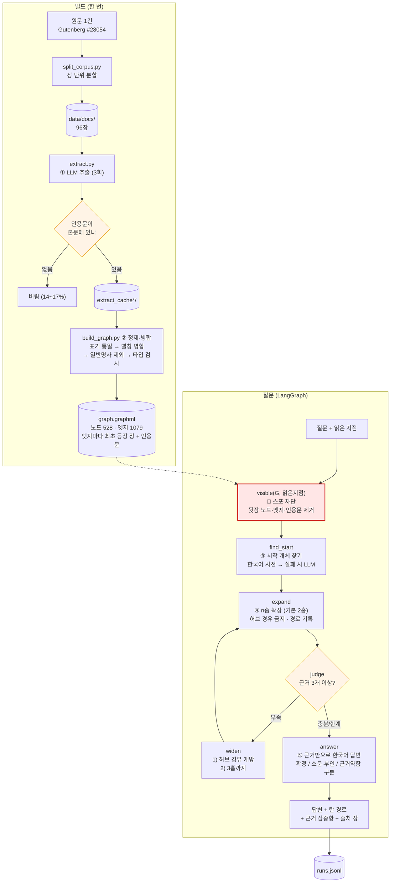

# REPORT — 카라마조프가의 형제들 스포 방지 GraphRAG 에이전트

> ⚠️ **미완성 항목 있음.** 최종 평가(v4)는 OpenAI 프로젝트 지출 한도 초과로 아직 못 돌렸습니다.
> 아래 측정 결과는 v1~v3까지이며, 현재 코드 상태(3회 추출 + 새 허브 규칙 + 소문 표시)는
> 아직 재측정되지 않았습니다. 해당 표에 그렇게 표시해 두었습니다.

---

## 1. 주제와 코퍼스

### 왜 이 주제인가

《카라마조프가의 형제들》을 읽을 때 두 가지가 계속 걸립니다.

1. **초반 진입장벽** — 인물이 한꺼번에 쏟아지고 누가 누구인지 안 잡힙니다.
2. **별명** — 러시아 소설 특유의 애칭·부칭이 섞여 나옵니다. *Dmitri = Mitya = Mitenka = Mitri*,
   *Alexey = Alyosha = Alyoshka*. 같은 사람인지 매번 막힙니다.

기존 방법으로는 해결이 안 됩니다. 위키백과나 일반 챗봇에 물으면 **아직 안 읽은 부분까지 말해버려서**,
궁금증을 푸는 대가로 스포를 당합니다. 그래서 "읽은 지점까지만 아는 도우미"를 만들기로 했습니다.

별명 문제는 과제의 **별칭 병합(정규화)** 단계와, 스포 문제는 **근거에 출처를 붙이는 것**과
정확히 맞아떨어져서, 억지로 갖다 붙이지 않아도 되는 주제였습니다.

### 코퍼스

| 항목 | 값 |
|---|---|
| 출처 | Project Gutenberg #28054 (Constance Garnett 영역, 1880년 원작) |
| 저작권 | 만료 (퍼블릭 도메인) |
| 단위 | **장(chapter)** |
| 문서 수 | **96건** (4부 → 12편 + 에필로그) |
| 분량 | 193만 자 |
| 장 길이 | 7천 자(1편 2장) ~ 5만 자(5편 5장 "대심문관") |

### 채택·탈락 기준

**한국어 번역본을 탈락시켰습니다.** 번역가 저작권이 살아 있어 저장소에 올릴 수 없습니다.
대가는 분명합니다 — **근거 인용문이 영어로 나옵니다.** 질문과 답변은 한국어지만,
"원문에 이렇게 써 있다"를 보여주는 대목만 영어입니다. 저작권과 근거 제시를 맞바꾼 결과입니다.

**위키백과·줄거리 요약도 탈락시켰습니다.** 스포 차단을 하려면 "이 사실은 3편 4장에서 나온다"를
알아야 하는데, 요약문에는 장 정보가 없습니다. 이 프로젝트에서는 **쓸 수가 없는** 자료입니다.

### 장 단위를 고른 이유

처음에는 편(Book) 단위 13건을 생각했습니다. 화면에서 고르기 쉬우니까요. 그런데 두 가지가 걸렸습니다.

- 13건은 과제 요건 **"50건 이상"에 미달**합니다.
- 한 편이 최대 14장이라 문서 하나가 너무 커집니다. **한 문서만 읽어도 답이 나와** 멀티홉을 증명 못 합니다.

그래서 **색인은 장 단위(96건), 화면은 슬라이더 + 편·장 2단 선택**으로 갈랐습니다.
정밀도는 장 단위로 얻고, 고르는 편의는 화면에서 해결했습니다.

여기서 장 단위였기에 **새로 생긴 문제**가 하나 있습니다 — 96장을 목록으로 늘어놓으면
**아직 안 읽은 장의 제목이 보입니다.** 도스토옙스키의 장 제목은 노골적인 게 많습니다.
그래서 읽은 지점 이후의 장은 **제목을 감추고 번호만** 보여줍니다.

---

## 2. 골든셋과 스키마

### 골든셋 13문항

| 종류 | 문항 수 | 비고 |
|---|---|---|
| 1홉 | 3 | 기준선 |
| 2홉 | 3 | |
| 3홉 | 2 | |
| 대조군(1문서로 풀림) | 1 | **basic RAG가 이겨야 정상** |
| 스포 차단 | 4 | 답을 하면 안 되는 문항 |

**인용문을 손으로 옮겨 적지 않았습니다.** `scripts/build_goldenset.py`가 정규식으로 원문에서
직접 뽑아내고, 못 찾으면 그 자리에서 실패합니다. 지어낸 근거가 섞일 수 없고,
"모든 근거가 읽은 지점 이내인가"도 자동 검사합니다.

### 기대 경로를 정한 기준

**서로 다른 장에 걸치게** 만들었습니다. 처음에 만든 문항 중 하나는
"드미트리가 사랑하는 여자 + 라키친이 그 여자의 친척"이 **2편 7장 한 장 안에** 다 들어 있었습니다.
그러면 한 문서만 읽어도 답이 나와서 멀티홉을 증명하지 못합니다. 그 문항은 폐기하고 다시 짰습니다.

일부러 까다롭게 넣은 것도 있습니다.

- **G06 (대조군)** — 한 장 안에서 풀립니다. basic RAG가 이겨야 정상이고,
  여기서까지 GraphRAG가 이긴다면 측정이 잘못된 겁니다.
- **G09** — 표도르를 **반드시 경유해야** 풀립니다. 그런데 표도르는 허브라 경유 금지입니다.
  허브 규칙과 정면으로 부딪히게 일부러 넣었습니다.
- **S04** — 같은 사실이 2편 7장에서 **부인**되고 12편 4장에서 **확인**됩니다.
  읽은 지점에 따라 답이 달라져야 합니다.

### 스키마

노드 5종 · 관계 **17종**. 처음엔 15종이었고, 측정 후 2종을 추가했습니다(아래 참조).

| 노드 | |
|---|---|
| Character | 이름이 있는 사람만 |
| Place | 수도원, 모크로예, 법정 |
| Group | 카라마조프 가문, 수도원 |
| Event | 이름 붙일 수 있는 일회성 사건 |
| Object | 3000루블, 절굿공이 등 줄거리를 움직이는 물건 |

관계 17종: `FATHER_OF` `BROTHER_OF` `SERVANT_OF` `MENTOR_OF` `RAISED` `RELATED_TO`
`LOVES` `ENGAGED_TO` `RIVAL_OF` `QUARRELS_WITH` `OWES_MONEY_TO` `MEMBER_OF`
`LIVES_AT` `PRESENT_AT` `ACCUSED_OF` `POSSESSES` `OCCURRED_AT`

### 뽑지 않기로 한 관계와 그 대가

| 안 뽑은 것 | 이유 | **대가** |
|---|---|---|
| `TALKS_TO` / `MEETS` | 거의 모든 인물 쌍에 붙어 그래프가 통째로 이어짐. 멀티홉이 의미를 잃음 | "누가 누구를 만났나" 류 질문에 못 답함 |
| `THINKS_ABOUT` / `BELIEVES` | 주관적이라 인용문으로 검증 불가 | **이 소설의 핵심인 사상 대립**("이반의 신 문제")에 아예 못 답함. 가장 뼈아픈 대가 |
| `SIMILAR_TO` | 추출기가 마음대로 만들어내기 쉬움 | 인물 비교 질문에 약함 |

### 스키마를 도중에 늘린 일 (v1 → v2)

v1(15종) 측정에서 멀티홉 정답률이 **0%**였습니다. 틀린 문항의 근거를 하나씩 열어보니
원인이 **탐색이 아니라 색인**이었습니다.

- "그리고리가 미챠를 **키웠다**" → `RAISED`가 없어서 그래프에 없음.
  추출기는 대신 "드미트리가 하인 오두막에 **산다**"는 옆길 관계만 뽑아놨습니다.
- "라키친이 그루셴카와 **친척**" → 친족 관계가 `FATHER_OF`/`BROTHER_OF`뿐이라 담을 곳이 없음.

둘 다 **원문에서 인용문으로 확인되는 관계**이고, 제가 제외 기준으로 삼은
*주관적·과다연결* 어디에도 걸리지 않습니다. 그래서 `RAISED`, `RELATED_TO`를 추가했습니다.

> "시험에 맞춰 답을 고친 것 아닌가"라는 지적이 가능합니다.
> 골든셋은 **원문을 읽고** 먼저 만들었고, 스키마의 구멍은 **측정으로 발견**했습니다.
> 순서가 이렇다면 스키마를 고치는 게 맞다고 판단했고, 과정을 그대로 적어 둡니다.

---

## 3. 측정 결과

### 홉 수별 · basic RAG 대조

basic RAG 대조군도 **같은 스포 차단**을 받습니다(읽은 지점 이후 조각은 검색에서 제외).
그래야 "멀티홉이 이겼는가"만 남습니다.

| 버전 | 바뀐 것 | 1홉 | 2홉 | 3홉 | 대조군 | 스포차단 | **전체** | basic RAG | 경로재현율 | 누수 |
|---|---|---|---|---|---|---|---|---|---|---|
| v1 | 관계 15종, 추출 1회, 허브=연결 상위 5% | 100% | 0% | 0% | 0% | 75% | **46%** | 62% | 43% | 0 |
| v2 | `RAISED`·`RELATED_TO` 추가 | 100% | 33% | 50% | 0% | 75% | **62%** | 54% | 54% | 0 |
| v3 | 허브 기준을 등장 장 수로 교체 | 100% | 33% | 50% | 100% | 75% | **69%** | 54% | 63% | 0 |
| v3.5 | 추출 2회 합집합 | 100% | 33% | 50% | 0% | 75% | **62%** | 54% | 69% | **1** |
| v4 | 추출 3회 + 소문 표시 + 근거 세기 | — | — | — | — | — | **미측정** | — | — | — |

**v1에서는 basic RAG가 이겼습니다(46% vs 62%).** 숨기지 않고 적습니다.
원인은 스키마 구멍이었고, v2에서 뒤집혔습니다.

**v3.5에서 경로 재현율은 올랐는데(63→69%) 정답률은 떨어졌습니다(69→62%).**
추출을 두 번 돌려 합치니 재현율과 함께 **노이즈도 늘었고**, 거기서 **스포 누수가 1건** 나왔습니다.
"많이 뽑을수록 좋다"가 아니라는 것을 보여주는 결과입니다.

### 실패의 층 분류

틀린 문항이 어디서 깨졌는지 세 층으로 가릅니다.

| 층 | 판정 방법 |
|---|---|
| **색인** | 기대한 삼중항이 그래프에 아예 없다 → 추출·정제가 깨진 것 |
| **탐색** | 그래프에는 있는데 못 가져왔다 → 확장·허브 규칙이 깨진 것 |
| **생성** | 가져왔는데 답이 틀렸다 → 답변 모델이 깨진 것 |

v1 실패 7건: 색인 2 · 탐색 4 · 생성 1
v3 실패 4건: 색인 3 · 생성 1

**분류기 자체를 한 번 고쳤습니다.** 처음에는 인물 이름의 낱말이 겹치면 "같은 인물"로 봤는데,
`captain` 같은 흔한 낱말 때문에 *Dmitri ↔ Captain Snegiryov* 가
*Dmitri ↔ Captain of police* 에 잘못 붙어서, **색인 실패를 탐색 실패로 오분류**하고 있었습니다.
성·부칭·직함 같은 공용 낱말을 제외하고 나서야 숫자가 맞았습니다.

### 규칙을 세 번 갈아엎은 이야기 — 허브 기준

가장 많이 틀린 부분이라 그대로 남깁니다.

| 차수 | 기준 | 깨진 방식 |
|---|---|---|
| 1차 | 연결 상위 5% | 연결 수 **중앙값이 1**인 극단적 분포라 상위 5%가 16명. **일류샤(연결 14)까지 허브**가 됐는데, 일류샤는 오히려 질문의 시작 개체였음 |
| 2차 | 연결 40개 이상 | 추출을 2회로 늘리자 엣지가 2배가 되면서 **콜랴(7장 등장)까지 허브**. 절대값이 그래프 크기에 흔들림 |
| 3차 | **본문 96장 중 50장 이상 등장** | 추출 횟수와 무관한 값. **카라마조프 4부자만** 남음 |

1·2차가 깨진 이유는 같습니다 — **엣지 수에 기댔기 때문**입니다.
엣지 수는 추출을 몇 번 돌렸는지에 따라 변합니다. 본문 등장 장 수는 변하지 않습니다.

### 허브 규칙과 G09의 충돌

G09("드미트리를 키운 하인이 모시는 주인의 아들 중 수도원에 들어간 사람")는
**그리고리 → 표도르 → 알료샤**로, 허브인 표도르를 반드시 경유해야 풀립니다.

경유를 아예 막으면 이런 질문이 통째로 죽습니다. 그래서 이렇게 정했습니다:

> **기본 반경에서는 허브 경유를 막고, 근거가 3개 미만이라 반경을 넓힐 때만 열어준다.**

먼저 허브를 피해 의미 있는 경로를 찾고, 그래도 없으면 허브를 연다 — 순서가 있는 규칙입니다.

---

## 4. 파이프라인 구조도

### LangGraph 상태(State)

| 필드 | 뜻 |
|---|---|
| `_G` | 읽은 지점까지만 남긴 그래프 |
| `question` / `read_point` | 질문 · 읽은 지점(1~96) |
| `starts` | 찾아낸 시작 개체 |
| `hops` / `allow_hub` | 현재 반경 · 허브 경유 개방 여부 (widen이 바꿈) |
| `triples` / `paths` | 모은 근거 · 실제로 탄 경로 |
| `answer` / `trace` | 답변 · 단계별 기록 (화면의 "어떻게 찾았나") |

---

## 5. 데모 설계

### 신경 쓴 것

1. **읽은 지점이 안 풀린다.** `session_state`에 들고 있어서 질문을 몇 번 하든 유지됩니다.
   책을 더 읽었을 때만 슬라이더를 밉니다.
2. **아직 안 읽은 장은 제목을 감춥니다.** 장 제목이 스포일러라서요.
   슬라이더를 주력 조작으로 둔 이유이기도 합니다 — 슬라이더는 애초에 제목을 안 보여줍니다.
3. **지금 몇 개가 보이는지 숫자로 보여줍니다.** "전체 1079개 중 194개" 처럼요.
   차단이 실제로 걸리고 있다는 걸 눈으로 확인할 수 있습니다.
4. **화면은 한국어, 근거는 영어.** 그래프가 영어라 노드 이름이 영어인데,
   읽는 사람은 한국어 번역본으로 읽고 있습니다. 화면 표기만 한국어로 바꾸고
   (`ko_labels.py`) **인용문은 원문 그대로** 둡니다.
5. **근거의 세기를 구분해 보여줍니다.** `⚠️ 소문·부인` / `· 근거 약함` 표시가 붙습니다.

### 화면 캡처

> ⚠️ **미완성.** 답변이 들어간 캡처는 API 한도가 풀린 뒤 넣습니다.
> 현재는 화면이 뜨는 것까지만 확인했습니다.

---

## 6. 프로젝트 회고

### 가장 공들인 부분

**"지어낸 근거"를 막는 장치.** 추출기가 돌려준 인용문이 본문에 실제로 있는지 글자 단위로 대조해서,
없으면 그 삼중항을 버립니다. **삼중항의 14~17%가 여기서 걸렸습니다.** 그만큼을 막은 셈입니다.

**별칭 병합.** 이 소설의 핵심 불편이라 제일 손이 많이 갔습니다. 그리고 여기서
**LLM을 그대로 믿으면 안 된다**는 걸 배웠습니다. 추출기가 알려준 별칭 중에

- `아델라이다 이바노브나 = 미우소프` (아델라이다는 표도르의 첫 아내입니다)
- `막시모프 = 폰 존` (표도르가 농담으로 빗댄 것뿐입니다)
- `카라마조프 = 드미트리` (카라마조프는 4명입니다)

같은 **엉뚱한 병합**이 섞여 있었습니다. 표시만 이상한 게 아니라 그래프가 오염됩니다.
그래서 "대표 이름과 낱말이 하나도 안 겹치면 받지 않는다"는 규칙을 넣어 43~134건을 걸러냈습니다.
대가로 `Misha → 라키친`(진짜 별명) 같은 것도 같이 걸려서, 원문에서 확인한 뒤 사전에 직접 넣었습니다.

### 실패에서 배운 것

- **처음 세운 규칙은 대체로 틀렸습니다.** 허브 기준을 세 번 갈아엎었고, 실패 분류기도 한 번 고쳤습니다.
  공통점은 **데이터를 보기 전에 정한 규칙**이라는 점입니다. 연결 중앙값이 1인 줄 알았으면
  "상위 5%"라고 쓰지 않았을 겁니다.
- **추출은 분산이 큽니다.** 같은 프롬프트·같은 장인데 삼중항이 11개 나왔다가 29개 나옵니다.
  이걸 발견하고 나서 "여러 번 뽑아 합치고, **몇 번 뽑혔는지를 근거의 세기로 쓰는**" 쪽으로 바꿨습니다.
- **재현율을 올리면 정밀도가 떨어집니다.** 2회 합집합에서 경로 재현율은 올랐지만
  스포 누수가 처음 나왔습니다. 이 프로젝트에서는 **누수가 최악의 실패**라 그냥 넘길 수 없었습니다.

### 앞으로 보완하고 싶은 것

1. **최종 측정을 마치는 것** — 지금 코드 상태(v4)는 아직 재측정되지 않았습니다.
2. **소문·부인 판정을 전 회차에 적용** — 1·2차 추출에는 이 항목이 없어서,
   `라키친-그루셴카 친척`처럼 **판정되지 않은 채 남은 관계**가 있습니다.
   지금은 "판정도 없고 한 번만 뽑힌 관계는 확정으로 쓰지 않는다"는 임시 안전장치로 막고 있습니다.
3. **Event 노드가 파편화됩니다.** 244개 중 상당수가
   "Elopement preceding the marriage of Fyodor Pavlovitch and Adelaïda Ivanovna" 같은
   긴 서술문이라 장이 다르면 안 합쳐집니다. 사건 이름을 정규화하는 단계가 필요합니다.
4. **모델 사전 지식 누수를 직접 시험하지 못했습니다.** 지금은 프롬프트로 막고 골든셋 4문항으로
   확인하는 수준입니다. "일부러 유도하는" 공격 문항을 더 넣어 봐야 합니다.
5. **관계도 그림** — PRD에서 "나중에"로 미뤄둔 것. 답변에 쓰인 부분 그래프를 그려주면
   읽기가 훨씬 편할 겁니다.
