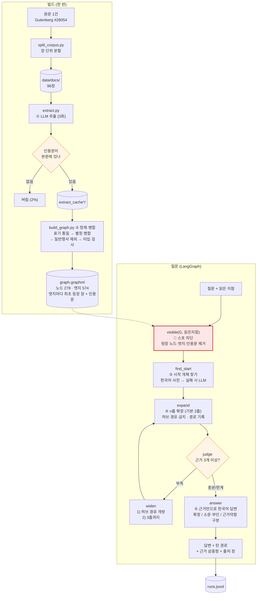
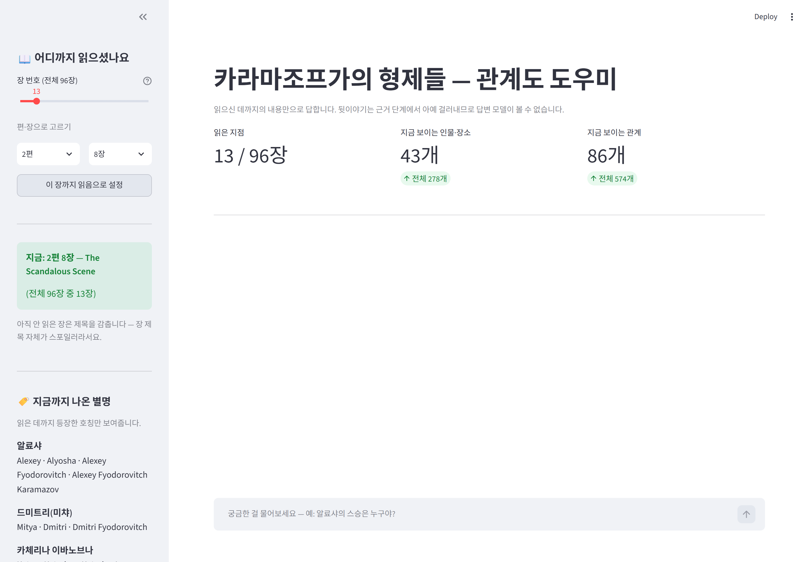
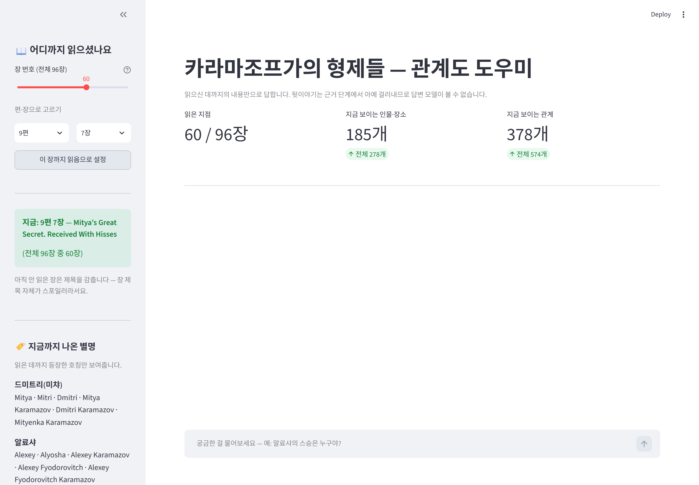
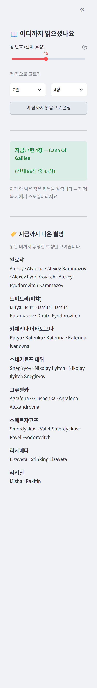
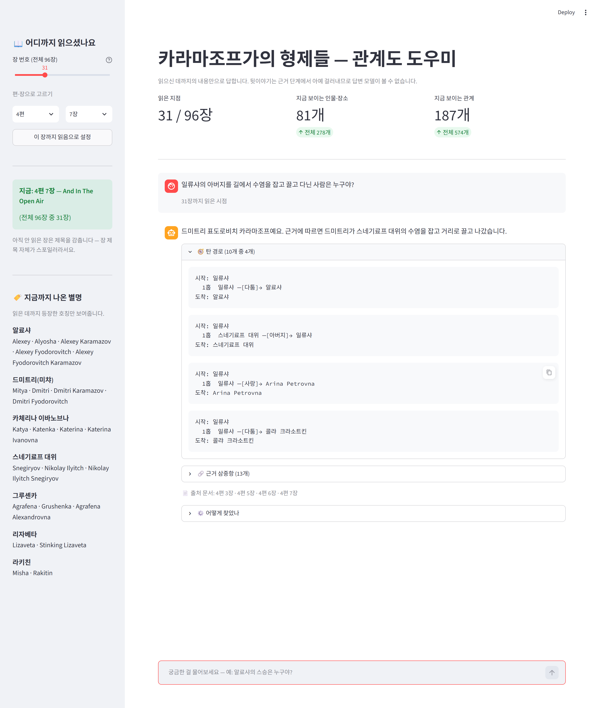
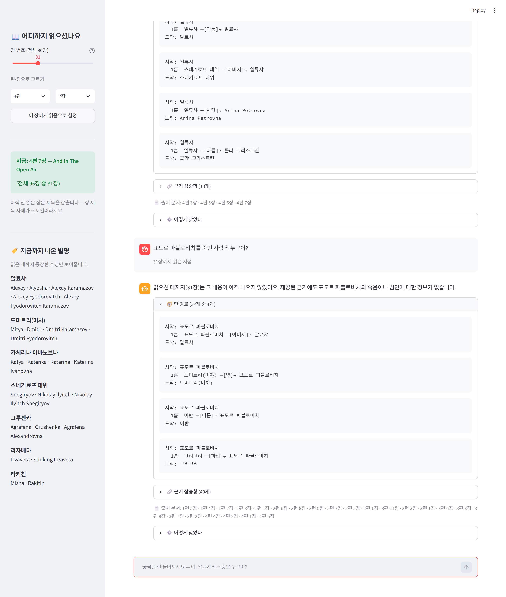

# REPORT — 카라마조프가의 형제들 스포 방지 GraphRAG 에이전트

**최종 결과: GraphRAG 85% vs basic RAG 62%, 경로 재현율 87%, 스포 누수 0건.**
측정 과정에서 규칙을 여러 번 갈아엎었고, 그 실패도 §3에 그대로 남겼습니다.

---

## 1. 주제와 코퍼스

### 왜 이 주제인가

《카라마조프가의 형제들》을 읽을 때 두 가지가 계속 걸립니다.

1. **초반 진입장벽** — 인물이 한꺼번에 쏟아지고 누가 누구인지 안 잡힙니다.
2. **별명** — 러시아 소설 특유의 애칭·부칭이 섞여 나옵니다. *Dmitri = Mitya = Mitenka = Mitri*,
   *Alexey = Alyosha = Alyoshka*. 같은 사람인지 매번 막힙니다.

기존 방법으로는 해결이 안 됩니다. 위키백과나 일반 챗봇에 물으면 **아직 안 읽은 부분까지 말해버려서**,
궁금증을 푸는 대가로 스포를 당합니다. 그래서 "읽은 지점까지만 아는 도우미"를 만들기로 했습니다.

별명 문제는 과제의 **별칭 병합(정규화)** 단계와, 스포 문제는 **근거에 출처를 붙이는 것**과
정확히 맞아떨어져서, 억지로 갖다 붙이지 않아도 되는 주제였습니다.

### 코퍼스

| 항목 | 값 |
|---|---|
| 출처 | Project Gutenberg #28054 (Constance Garnett 영역, 1880년 원작) |
| 저작권 | 만료 (퍼블릭 도메인) |
| 단위 | **장(chapter)** |
| 문서 수 | **96건** (4부 → 12편 + 에필로그) |
| 분량 | 193만 자 |
| 장 길이 | 7천 자(1편 2장) ~ 5만 자(5편 5장 "대심문관") |

### 채택·탈락 기준

**한국어 번역본을 탈락시켰습니다.** 번역가 저작권이 살아 있어 저장소에 올릴 수 없습니다.
대가는 분명합니다 — **근거 인용문이 영어로 나옵니다.** 질문과 답변은 한국어지만,
"원문에 이렇게 써 있다"를 보여주는 대목만 영어입니다. 저작권과 근거 제시를 맞바꾼 결과입니다.

**위키백과·줄거리 요약도 탈락시켰습니다.** 스포 차단을 하려면 "이 사실은 3편 4장에서 나온다"를
알아야 하는데, 요약문에는 장 정보가 없습니다. 이 프로젝트에서는 **쓸 수가 없는** 자료입니다.

### 장 단위를 고른 이유

처음에는 편(Book) 단위 13건을 생각했습니다. 화면에서 고르기 쉬우니까요. 그런데 두 가지가 걸렸습니다.

- 13건은 과제 요건 **"50건 이상"에 미달**합니다.
- 한 편이 최대 14장이라 문서 하나가 너무 커집니다. **한 문서만 읽어도 답이 나와** 멀티홉을 증명 못 합니다.

그래서 **색인은 장 단위(96건), 화면은 슬라이더 + 편·장 2단 선택**으로 갈랐습니다.
정밀도는 장 단위로 얻고, 고르는 편의는 화면에서 해결했습니다.

장 단위였기에 **새로 생긴 문제**도 있습니다 — 96장을 목록으로 늘어놓으면
**아직 안 읽은 장의 제목이 보입니다.** 도스토옙스키의 장 제목은 노골적인 게 많습니다.
그래서 읽은 지점 이후의 장은 **제목을 감추고 번호만** 보여줍니다.

---

## 2. 골든셋과 스키마

### 골든셋 13문항

| 종류 | 문항 수 | 비고 |
|---|---|---|
| 1홉 | 3 | 기준선 |
| 2홉 | 3 | |
| 3홉 | 2 | |
| 대조군(1문서로 풀림) | 1 | **basic RAG가 이겨야 정상** |
| 스포 차단 | 4 | 답을 하면 안 되는 문항 |

**인용문을 손으로 옮겨 적지 않았습니다.** `scripts/build_goldenset.py`가 정규식으로 원문에서
직접 뽑아내고, 못 찾으면 그 자리에서 실패합니다. 지어낸 근거가 섞일 수 없고,
"모든 근거가 읽은 지점 이내인가"도 자동 검사합니다.

### 기대 경로를 정한 기준

**서로 다른 장에 걸치게** 만들었습니다. 처음에 만든 문항 중 하나는
"드미트리가 사랑하는 여자 + 라키친이 그 여자의 친척"이 **2편 7장 한 장 안에** 다 들어 있었습니다.
그러면 한 문서만 읽어도 답이 나와서 멀티홉을 증명하지 못합니다. 그 문항은 폐기하고 다시 짰습니다.

일부러 까다롭게 넣은 것도 있습니다.

- **G06 (대조군)** — 한 장 안에서 풀립니다. basic RAG가 이겨야 정상이고,
  여기서까지 GraphRAG가 이긴다면 측정이 잘못된 겁니다.
- **G09** — 표도르를 **반드시 경유해야** 풀립니다. 그런데 표도르는 허브라 경유 금지입니다.
  허브 규칙과 정면으로 부딪히게 일부러 넣었습니다.
- **S04** — 같은 사실이 2편 7장에서 **부인**되고 12편 4장에서 **확인**됩니다.
  읽은 지점에 따라 답이 달라져야 합니다.

### 스키마

노드 5종 · 관계 **17종**. 처음엔 15종이었고, 측정 후 2종을 추가했습니다(아래 참조).

| 노드 | |
|---|---|
| Character | 이름이 있는 사람만 |
| Place | 수도원, 모크로예, 법정 |
| Group | 카라마조프 가문, 수도원 |
| Event | 이름 붙일 수 있는 일회성 사건 |
| Object | 3000루블, 절굿공이 등 줄거리를 움직이는 물건 |

관계 17종: `FATHER_OF` `BROTHER_OF` `SERVANT_OF` `MENTOR_OF` `RAISED` `RELATED_TO`
`LOVES` `ENGAGED_TO` `RIVAL_OF` `QUARRELS_WITH` `OWES_MONEY_TO` `MEMBER_OF`
`LIVES_AT` `PRESENT_AT` `ACCUSED_OF` `POSSESSES` `OCCURRED_AT`

### 뽑지 않기로 한 관계와 그 대가

| 안 뽑은 것 | 이유 | **대가** |
|---|---|---|
| `TALKS_TO` / `MEETS` | 거의 모든 인물 쌍에 붙어 그래프가 통째로 이어짐. 멀티홉이 의미를 잃음 | "누가 누구를 만났나" 류 질문에 못 답함 |
| `THINKS_ABOUT` / `BELIEVES` | 주관적이라 인용문으로 검증 불가 | **이 소설의 핵심인 사상 대립**("이반의 신 문제")에 아예 못 답함. 가장 뼈아픈 대가 |
| `SIMILAR_TO` | 추출기가 마음대로 만들어내기 쉬움 | 인물 비교 질문에 약함 |

### 스키마를 도중에 늘린 일 (v1 → v2)

v1(15종) 측정에서 멀티홉 정답률이 **0%**였습니다. 틀린 문항의 근거를 하나씩 열어보니
원인이 **탐색이 아니라 색인**이었습니다.

- "그리고리가 미챠를 **키웠다**" → `RAISED`가 없어서 그래프에 없음.
  추출기는 대신 "드미트리가 하인 오두막에 **산다**"는 옆길 관계만 뽑아놨습니다.
- "라키친이 그루셴카와 **친척**" → 친족 관계가 `FATHER_OF`/`BROTHER_OF`뿐이라 담을 곳이 없음.

둘 다 **원문에서 인용문으로 확인되는 관계**이고, 제가 제외 기준으로 삼은
*주관적·과다연결* 어디에도 걸리지 않습니다. 그래서 `RAISED`, `RELATED_TO`를 추가했습니다.

> "시험에 맞춰 답을 고친 것 아닌가"라는 지적이 가능합니다.
> 골든셋은 **원문을 읽고** 먼저 만들었고, 스키마의 구멍은 **측정으로 발견**했습니다.
> 순서가 이렇다면 스키마를 고치는 게 맞다고 판단했고, 과정을 그대로 적어 둡니다.

### 최종 그래프 (Gemini 3회 추출)

| | 값 |
|---|---|
| 노드 | 278개 (인물 115 · 장소 62 · 사건 48 · 물건 43 · 집단 10) |
| 엣지 | 574개 |
| 원본 삼중항 | 3111개 → 정제 후 2729개 → 중복 병합하여 574 엣지 |
| 허브 | 4개 (카라마조프 4부자) |

---

## 3. 측정 결과

### 홉 수별 · basic RAG 대조

basic RAG 대조군도 **같은 스포 차단**을 받습니다(읽은 지점 이후 조각은 검색에서 제외).
그래야 "멀티홉이 이겼는가"만 남습니다.

| 버전 | 바뀐 것 | 1홉 | 2홉 | 3홉 | 대조군 | 스포차단 | **전체** | basic RAG | 경로재현율 | 누수 |
|---|---|---|---|---|---|---|---|---|---|---|
| v1 | 관계 15종, 추출 1회, 허브=연결 상위 5% | 100% | 0% | 0% | 0% | 75% | **46%** | 62% | 43% | 0 |
| v2 | `RAISED`·`RELATED_TO` 추가 | 100% | 33% | 50% | 0% | 75% | **62%** | 54% | 54% | 0 |
| v3 | 허브 기준을 등장 장 수로 교체 | 100% | 33% | 50% | 100% | 75% | **69%** | 54% | 63% | 0 |
| v3.5 | 추출 2회 합집합 | 100% | 33% | 50% | 0% | 75% | **62%** | 54% | 69% | **1** |
| **v4** | **Gemini 3회 추출 + 소문 표시 + 근거 세기** | **100%** | **67%** | **50%** | **100%** | **100%** | **85%** | 62% | **87%** | **0** |

*v1~v3.5: OpenAI(gpt-5-mini) 추출. v4: Gemini(3.6-flash) 추출.
답변·채점은 전 구간 gpt-5, basic RAG 는 전 구간 임베딩 검색(text-embedding-3-small).
추출 모델이 바뀌었으므로 v3.5 → v4 는 파이프라인 개선분과 모델 교체분이 섞여 있습니다.*

### 최종(v4) 문항별

| 문항 | 종류 | 홉 | GraphRAG | basic RAG | 경로재현율 |
|---|---|---|---|---|---|
| G01 알료샤의 아버지 | 멀티홉 | 1 | O | O | 100% |
| G02 조시마가 머무는 곳 | 멀티홉 | 1 | O | **X** | 100% |
| G03 그리고리가 모시는 집 | 멀티홉 | 1 | O | O | 100% |
| G04 일류샤 아버지 수염을 잡은 사람 | 멀티홉 | 2 | O | O | 100% |
| G05 조시마 제자를 데려간 사람 | 멀티홉 | 2 | **X** | X | 50% |
| G06 (대조군, 한 장에서 풀림) | 대조군 | 2 | O | O | 100% |
| G07 그루셴카 친척이라 부인한 사람 | 멀티홉 | 2 | O | **X** | 100% |
| G08 일류샤 아버지를 모욕한 사람의 약혼자 | 멀티홉 | 3 | **X** | X | 67% |
| G09 허브(표도르)를 반드시 경유 | 멀티홉 | 3 | O | O | 67% |
| S01~S03 스포 차단 | 스포차단 | - | O O O | O O O | - |
| S04 소문을 사실로 말하면 실패 | 스포차단 | - | O | **X** | - |

**대조군 G06 이 양쪽 다 정답**인 것이 중요합니다. 한 장 안에서 풀리는 문항이라
basic RAG 가 못 맞히면 측정이 잘못된 것입니다. 여기서 GraphRAG만 이겼다면
문항 설계를 의심해야 했습니다.

**S04는 GraphRAG만 맞혔습니다.** "라키친과 그루셴카는 친척 맞아?"에 대해
basic RAG는 원문 조각을 보고 사실로 단정했고, GraphRAG는 그 관계가
`소문·부인`으로 표시돼 있어 "확정되지 않았다"고 답했습니다.
추출 단계에서 `disputed` 를 판정해 둔 것이 여기서 값을 했습니다.

### 남은 실패 2건

| 문항 | 층 | 무엇이 없었나 |
|---|---|---|
| G05 | **색인** | "라키친이 알료샤를 그루셴카에게 데려갔다"를 담을 관계가 스키마에 없음. `TOOK_TO` 류를 뺀 대가 |
| G08 | **탐색** | 3홉 사슬(일류샤 → 스네기료프 → 드미트리 → 카체리나)에서 마지막 칸을 못 밟음. 드미트리가 허브라 경유가 막혔고, 근거가 3개 이상이라 허브 개방 조건이 발동하지 않음 |

G08 은 **허브 규칙의 한계를 그대로 보여줍니다.** 지금 규칙은 "근거가 모자랄 때만 허브를 연다"인데,
근거가 많아도 *엉뚱한* 근거만 많을 수 있습니다. 개수가 아니라 질문과의 관련도로
판단해야 한다는 뜻인데, 이번에는 거기까지 못 갔습니다.

**v1에서는 basic RAG가 이겼습니다(46% vs 62%).** 숨기지 않고 적습니다.
원인은 스키마 구멍이었고, v2에서 뒤집혔습니다.

**v3.5에서 경로 재현율은 올랐는데(63→69%) 정답률은 떨어졌습니다(69→62%).**
추출을 두 번 돌려 합치니 재현율과 함께 **노이즈도 늘었고**, 거기서 **스포 누수가 1건** 나왔습니다.
"많이 뽑을수록 좋다"가 아니라는 것을 보여주는 결과입니다.

### 실패의 층 분류

틀린 문항이 어디서 깨졌는지 세 층으로 가릅니다.

| 층 | 판정 방법 |
|---|---|
| **색인** | 기대한 삼중항이 그래프에 아예 없다 → 추출·정제가 깨진 것 |
| **탐색** | 그래프에는 있는데 못 가져왔다 → 확장·허브 규칙이 깨진 것 |
| **생성** | 가져왔는데 답이 틀렸다 → 답변 모델이 깨진 것 |

v1 실패 7건: 색인 2 · 탐색 4 · 생성 1
v3 실패 4건: 색인 3 · 생성 1

**분류기 자체를 한 번 고쳤습니다.** 처음에는 인물 이름의 낱말이 겹치면 "같은 인물"로 봤는데,
`captain` 같은 흔한 낱말 때문에 *Dmitri ↔ Captain Snegiryov* 가
*Dmitri ↔ Captain of police* 에 잘못 붙어서, **색인 실패를 탐색 실패로 오분류**하고 있었습니다.
성·부칭·직함 같은 공용 낱말을 제외하고 나서야 숫자가 맞았습니다.

### 규칙을 세 번 갈아엎은 이야기 — 허브 기준

가장 많이 틀린 부분이라 그대로 남깁니다.

| 차수 | 기준 | 깨진 방식 |
|---|---|---|
| 1차 | 연결 상위 5% | 연결 수 **중앙값이 1**인 극단적 분포라 상위 5%가 16명. **일류샤(연결 14)까지 허브**가 됐는데, 일류샤는 오히려 질문의 시작 개체였음 |
| 2차 | 연결 40개 이상 | 추출을 2회로 늘리자 엣지가 2배가 되면서 **콜랴(7장 등장)까지 허브**. 절대값이 그래프 크기에 흔들림 |
| 3차 | **본문 96장 중 50장 이상 등장** | 추출 횟수와 무관한 값. **카라마조프 4부자만** 남음 |

1·2차가 깨진 이유는 같습니다 — **엣지 수에 기댔기 때문**입니다.
엣지 수는 추출을 몇 번 돌렸는지에 따라 변합니다. 본문 등장 장 수는 변하지 않습니다.

### 허브 규칙과 G09의 충돌

G09("드미트리를 키운 하인이 모시는 주인의 아들 중 수도원에 들어간 사람")는
**그리고리 → 표도르 → 알료샤**로, 허브인 표도르를 반드시 경유해야 풀립니다.

경유를 아예 막으면 이런 질문이 통째로 죽습니다. 그래서 이렇게 정했습니다:

> **기본 반경에서는 허브 경유를 막고, 근거가 3개 미만이라 반경을 넓힐 때만 열어준다.**

먼저 허브를 피해 의미 있는 경로를 찾고, 그래도 없으면 허브를 연다 — 순서가 있는 규칙입니다.

### 제공자를 바꾼 이유와 결과 (OpenAI → Gemini)

OpenAI 프로젝트가 지출 한도에 걸려 중간에 Gemini로 갈아탔습니다.
LLM 호출을 `llm.py` 한 곳으로 모아 `config.json`의 `"provider"`만 바꾸면 되도록 했습니다.

바꾸고 나서 추출 품질이 **눈에 띄게** 좋아졌습니다. 같은 프롬프트인데도요.

| | OpenAI (gpt-5-mini) | Gemini (3.6-flash) |
|---|---|---|
| 인용문 대조 실패율 | 14~17% | **2%** |
| 일반명사로 버린 삼중항 | 1185건 | **315건** |
| Event 노드 파편화 | 244개 | **48개** |

"본문에서 그대로 베껴라", "일반명사를 노드로 만들지 마라" 같은 **제약 지시를 지키는 정도**가
달랐습니다. 프롬프트를 고쳐서 얻은 개선이 아니라 모델 교체만으로 얻은 차이라,
같은 파이프라인이라도 추출 모델 선택이 결과를 크게 좌우한다는 걸 보여줍니다.

### 대조군을 BM25로 바꿨다가 되돌린 일

API 비용을 아끼려고 basic RAG 를 임베딩 대신 BM25(낱말 겹침)로 바꿔 돌렸더니
**전 문항 0%** 가 나왔습니다. 처음엔 GraphRAG 가 압승한 줄 알았는데, 원인은 따로 있었습니다 —
**질문은 한국어인데 본문이 영어**라 겹치는 낱말이 하나도 없었습니다. 검색 점수가 전부 0이라
대조군이 아무것도 못 찾고 매번 "아직 안 나왔다"고 답한 것입니다.

낱말 기반 검색은 **질문과 코퍼스의 언어가 다르면 대조군으로 성립하지 않습니다.**
그대로 실었으면 85% vs 23% 라는 잘못된 표를 냈을 뻔했습니다.
임베딩으로 되돌려 다시 잰 것이 위의 62% 입니다.
(BM25 구현은 `evaluate.py` 에 남겨두고 `--bm25` 로 재현할 수 있게 했습니다.)

---

## 4. 파이프라인 구조도

### LangGraph 상태(State)

| 필드 | 뜻 |
|---|---|
| `_G` | 읽은 지점까지만 남긴 그래프 |
| `question` / `read_point` | 질문 · 읽은 지점(1~96) |
| `starts` | 찾아낸 시작 개체 |
| `hops` / `allow_hub` | 현재 반경 · 허브 경유 개방 여부 (widen이 바꿈) |
| `triples` / `paths` | 모은 근거 · 실제로 탄 경로 |
| `answer` / `trace` | 답변 · 단계별 기록 (화면의 "어떻게 찾았나") |

---

## 5. 데모 설계

### 신경 쓴 것

1. **읽은 지점이 안 풀린다.** `session_state`에 들고 있어서 질문을 몇 번 하든 유지됩니다.
   책을 더 읽었을 때만 슬라이더를 밉니다.
2. **아직 안 읽은 장은 제목을 감춥니다.** 장 제목이 스포일러라서요.
   슬라이더를 주력 조작으로 둔 이유이기도 합니다 — 슬라이더는 애초에 제목을 안 보여줍니다.
3. **지금 몇 개가 보이는지 숫자로 보여줍니다.** 13장 시점에 "전체 278개 중 43개",
   "전체 574개 중 86개" 처럼요. 차단이 실제로 걸리고 있다는 걸 눈으로 확인할 수 있습니다.
4. **화면은 한국어, 근거는 영어.** 그래프가 영어라 노드 이름이 영어인데,
   읽는 사람은 한국어 번역본으로 읽고 있습니다. 화면 표기만 한국어로 바꾸고
   (`ko_labels.py`) **인용문은 원문 그대로** 둡니다.
5. **근거의 세기를 구분해 보여줍니다.** `⚠️ 소문·부인` / `· 근거 약함` 표시가 붙습니다.
6. **별명 패널을 읽은 만큼만 채웁니다.** 이 프로젝트를 시작한 이유라 특히 손봤습니다.

   | 읽은 지점 | 보이는 별명 |
   |---|---|
   | 13장 | 알료샤 · 드미트리(Mitya) · 카체리나(Katya) · 라키친(Misha) |
   | 45장 | + 그루셴카(Agrafena) · 스메르쟈코프(Pavel Fyodorovitch) · 스네기료프 · 리자베타 |

   여기서도 두 번 고쳤습니다. 라틴 문자가 한글보다 먼저 정렬돼서 **정작 헷갈리는 주요 인물이
   목록 아래로 밀렸고**, `Adelaïda Ivanovna Miüsov · Adelaïda Ivanovna` 처럼
   **긴 이름/짧은 이름 쌍**이 별명 행세를 하고 있었습니다.

### 화면 캡처

**읽은 지점 13장** — 전체 278개 중 43개, 574개 관계 중 86개만 보입니다.

**읽은 지점 60장** — 같은 화면인데 185개 / 378개로 늘어납니다.
차단이 말로만이 아니라 실제로 걸린다는 것을 숫자로 보여주려고 이 지표를 넣었습니다.

**별명 사전 (45장 시점)** — 이 프로젝트를 시작한 이유입니다.

**질문에 답한 화면** — 31장까지 읽은 시점에서 2홉 질문.
답변 밑에 탄 경로 · 근거 삼중항 13개 · 출처 장이 함께 나옵니다.

**같은 지점에서 뒷이야기를 물었을 때** — 아직 안 나왔다고 답합니다.

캡처는 `python scripts/capture.py --with-answer` 로 자동 생성됩니다.

---

## 6. 프로젝트 회고

### 가장 공들인 부분

**"지어낸 근거"를 막는 장치.** 추출기가 돌려준 인용문이 본문에 실제로 있는지 글자 단위로 대조해서,
없으면 그 삼중항을 버립니다. OpenAI에서는 14~17%, Gemini에서는 2%가 여기서 걸렸습니다.
**이 장치가 없었으면 그만큼이 근거인 척 들어갔을 것**입니다.

**별칭 병합.** 이 소설의 핵심 불편이라 제일 손이 많이 갔습니다. 그리고 여기서
**LLM을 그대로 믿으면 안 된다**는 걸 배웠습니다. 추출기가 알려준 별칭 중에

- `아델라이다 이바노브나 = 미우소프` (아델라이다는 표도르의 첫 아내입니다)
- `막시모프 = 폰 존` (표도르가 농담으로 빗댄 것뿐입니다)
- `카라마조프 = 드미트리` (카라마조프는 4명입니다)

같은 **엉뚱한 병합**이 섞여 있었습니다. 표시만 이상한 게 아니라 그래프가 오염됩니다.
그래서 "대표 이름과 낱말이 하나도 안 겹치면 받지 않는다"는 규칙을 넣어 걸러냈습니다.
대가로 `Misha → 라키친`(진짜 별명)도 같이 걸려서, 원문에서 확인한 뒤 사전에 직접 넣었습니다.

### 실패에서 배운 것

- **처음 세운 규칙은 대체로 틀렸습니다.** 허브 기준을 세 번, 실패 분류기를 한 번,
  별명 패널을 두 번 고쳤습니다. 공통점은 **데이터를 보기 전에 정한 규칙**이라는 점입니다.
  연결 중앙값이 1인 줄 알았으면 "상위 5%"라고 쓰지 않았을 겁니다.
- **추출은 분산이 큽니다.** 같은 프롬프트·같은 장인데 삼중항이 11개 나왔다가 29개 나옵니다.
  이걸 발견하고 "여러 번 뽑아 합치고, **몇 번 뽑혔는지를 근거의 세기로 쓰는**" 쪽으로 바꿨습니다.
- **재현율을 올리면 정밀도가 떨어집니다.** 2회 합집합에서 경로 재현율은 올랐지만
  스포 누수가 처음 나왔습니다. 이 프로젝트에서는 **누수가 최악의 실패**라 그냥 넘길 수 없었습니다.
- **비용을 계획에 넣지 않았습니다.** 추출 96장 × 3회를 두 제공자에서 반복하다
  양쪽 다 한도를 소진했습니다. "고치고 다시 돌린다"를 몇 번 할지 미리 정해두고
  예산을 나눴어야 했습니다. 이번 프로젝트에서 가장 뼈아픈 실수입니다.
- **대조군이 망가진 것을 결과로 착각할 뻔했습니다.** BM25로 바꿨더니 GraphRAG 85% vs 23%
  라는 압승이 나왔는데, 실은 한국어 질문과 영어 본문이라 대조군이 아무것도 못 찾은 것이었습니다.
  **내게 유리한 숫자가 나왔을 때 한 번 더 의심해야 한다**는 걸 배웠습니다.

### 앞으로 보완하고 싶은 것

1. **허브 개방 조건을 '개수'가 아니라 '관련도'로.** G08이 여기서 깨졌습니다.
   근거가 3개 이상이면 허브를 안 여는데, 엉뚱한 근거만 많아도 조건이 채워집니다.
2. **경로 표시를 답변과 묶기.** 지금은 근거 순서로 정렬하는 임시 방편이라,
   답에 실제로 쓰이지 않은 경로가 섞입니다. 답변 생성이 어떤 삼중항을 썼는지
   모델에게 같이 받아오면 정확해집니다.
3. **모델 사전 지식 누수를 더 세게 시험.** 스포 누수 0건이지만 골든셋 4문항 수준입니다.
   "일부러 유도하는" 공격 문항을 더 넣어 봐야 합니다.
4. **관계도 그림** — PRD에서 "나중에"로 미뤄둔 것.
5. **Event 노드 정규화** — Gemini로 바꾸며 244개→48개로 줄었지만,
   여전히 서술문 형태의 사건 이름이 남아 장이 다르면 안 합쳐집니다.
